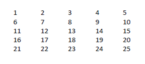

# Aula 3 - Arranjos (Vetores e Matrizes)
exercícios de Vetores e Matrizes passados em aula para lógica de programação - feitos em C#

# Vetores
## Atividade 1
Escreva um programa que armazene em um vetor todos os números inteiros de 0 a 50. Após isso, o
programa deve imprimir todos os valores armazenados.

## Atividade 2
Escreva um programa que armazene em um vetor todos os números pares do intervalo fechado de 1 a 100. Após isso, o programa deve imprimir todos os valores armazenados.

## Atividade 3
Escreva um programa que armazene em um vetor os 100 primeiros números ímpares. Após isso, o
programa deve imprimir todos os valores armazenados.

## Atividade 4
Escreva um programa que receba dez números do usuário e armazene em um vetor a metade de cada
número. Após isso, o programa deve imprimir todos os valores armazenados.

# Matrizes

## Atividade 5
Escreva um programa que entre com valores para uma matriz M(5x5) e imprima a matriz final, como exemplo mostrado abaixo:

## Atividade 6
Entrar com valores inteiros para um matriz A(4x4) e para uma matriz B(4x4). Gerar e imprimir uma outra matriz com a SOMA (A+B).

## Atividade 7
Criar um programa que carregue uma matriz 12 x 4 com os valores das vendas de uma loja, em que cada linha represente um mês do ano, e cada coluna, uma semana do mês.
Para fins de simplificação considere que cada mês possui somente 4 semanas. Calcule e imprima:
- Total vendido em cada mês do ano;
- Total vendido em cada semana durante todo o ano;
- Total vendido no ano.